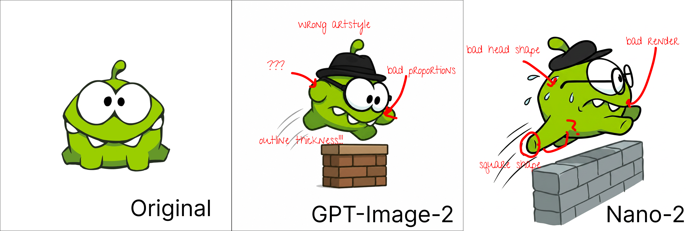

# 🎨 Style Consistency for Visual AI

**Agent skills for keeping AI-generated visuals on-model — same character, same style, same world, across every generation.**

   



*This is the 30% problem: two frontier multimodal models, one well-known character, and every generation drifts — art style, proportions, outlines, head shape, render quality.*

AI image generation is *OK* for about 70% of use cases — generic styles the models have seen a million times. But what about the other 30%? What happens when **your** style sits in a region the multimodal models were never trained on?

Usually: massive style drift. Wrong proportions, wrong colors, wrong art style, wrong lighting — and hallucinated details that were never part of the design. The model quietly pulls your character back toward the generic styles it knows.

Training a LoRA is the reflex answer, but it comes with real downsides: it trades away the model's creativity, it locks you to one identity per adapter — mixing several brand assets in one scene gets hard fast — and every style tweak means retraining. Most teams reach for it far earlier than they need to.

These skills encode a different path: a disciplined, training-free workflow that holds visual identity steady — for a character, an object, a background, or a full video shot — and escalates to heavier machinery only when the cheap fixes demonstrably fail.

## 💡 The approach

Everything in this repo follows a few core ideas:

**🔍 The smallest possible edit.** Generation models preserve identity best when they have to invent the least. So never generate from scratch when you can edit from close: start from the reference nearest to the target, and prompt only the *delta* — what should change, never a re-description of the style the reference already carries. Long style prompts don't reinforce a reference; they fight it.

**🗺️ A representative atlas.** One great image beats a paragraph of description; a well-built reference sheet beats one great image. An atlas that covers the identity's key views, expressions, and details gives the model an anchor for any request — and when you have several references, the workflow always picks the *closest* one to the pose and situation being asked for, shrinking the edit again.

**📏 Accurate, corrective guidelines.** Not a style bible — a short list of rules targeting exactly what the model gets wrong for *this* identity ("always four fingers", "the scar is over the left eye"). One precise corrective line often fixes what an entire dataset can't. Guidelines earn their place by fixing observed failures, not by describing everything.

**🧭 The right model for each task.** Models are not interchangeable: some excel at following reference images, others at rendering text inside the image, masked edits, or motion. The workflow detects what's available, routes each job to the model that wins *that* job — and when one model can't hold identity *and* nail a complex scene, splits the work into an identity stage and a composition stage.

**🪜 Escalate only when forced.** The approaches form a ladder — from a one-line guideline, to references and atlases, to curated datasets, to multi-stage pipelines, to training. Each rung costs more than the last. Start at the cheapest rung that plausibly solves the problem, and climb only when the current rung demonstrably falls short. Most "we need to fine-tune" problems are actually a bloated prompt or the wrong reference.

## 🧰 The skills

| Skill | Status | What it does |
|-------|--------|--------------|
| [`character-consistency`](skills/character-consistency/SKILL.md) | ✅ Available | Keep a recurring character on-model across generations and edits — triage, the ladder of approaches, and a per-generation verify-and-fix loop |
| [`model-integration`](skills/model-integration/SKILL.md) | ✅ Available | The execution layer: detect available providers (Gemini / Nano Banana, fal.ai, Replicate, OpenAI, xAI), route each job to the right model, invoke it reproducibly, recover from failures |
| [`background-consistency`](skills/background-consistency/PLACEHOLDER.md) | 🚧 Planned | Consistent environments, settings, and world details |
| [`object-consistency`](skills/object-consistency/PLACEHOLDER.md) | 🚧 Planned | Recurring props and products that stay on-model |
| [`video-consistency`](skills/video-consistency/PLACEHOLDER.md) | 🚧 Planned | Style and identity across frames and shots in AI video |

The consistency skills decide *what* to prompt and *which reference* to condition on; `model-integration` turns that decision into an actual API call.

## 🚀 How to use

### Option A — Install as a skill

Drop a skill into any skills-aware agent (Claude Code, Claude Projects, or anything that reads the `SKILL.md` convention):

```bash
# Claude Code: personal skills directory
git clone https://github.com/GenielabsOpenSource/style-consistency-ai
cp -R style-consistency-ai/skills/character-consistency ~/.claude/skills/
cp -R style-consistency-ai/skills/model-integration ~/.claude/skills/
```

Or paste the contents of a `SKILL.md` into a Claude Project's instructions. The skill auto-triggers whenever a conversation involves generating a recurring character — no configuration needed. Reference files load on demand, so the skills stay cheap in context.

### Option B — Build an agent around it

For a dedicated character-generation product or internal tool, use the skills as the brain of a purpose-built agent (e.g. with the [Claude Agent SDK](https://docs.claude.com/en/api/agent-sdk/overview)):

1. Load `character-consistency/SKILL.md` as (part of) the system prompt; keep `references/` fetchable as files or tools.
2. Give the agent your image-generation tools — an MCP server, or direct provider APIs following `model-integration`'s patterns.
3. Store each character's assets (atlas, guidelines, dataset) where the agent can read them — the recommended layout is in the skill.
4. The agent runs the full loop autonomously: classify the request → pick the closest reference → prompt the delta → generate → verify against the identity checklist → fix drift at the cheapest level.

The skills are plain Markdown with no runtime dependencies, so they port to any framework that can follow instructions.

## 🏭 Genielabs — for production teams

These skills are the open, agent-sized distillation of how [**Genielabs**](https://genielabs.tech) approaches visual consistency for real production pipelines — game studios and creative teams generating thousands of on-model assets, not one-off images. If you need character consistency at production scale — datasets, routing, evaluation, and training — 👉 [**genielabs.tech**](https://genielabs.tech) 👈 Reach out, we'd love to hear from you.

## 🤝 Contributing

PRs welcome — see [CONTRIBUTING.md](CONTRIBUTING.md). All PRs require maintainer approval. Especially:

- ✍️ The planned skills — `background-consistency`, `object-consistency`, `video-consistency`
- 🔌 New provider references for `model-integration` (Midjourney, Ideogram, local ComfyUI/SD…)
- 📊 Before/after examples showing a rung of the ladder fixing a real drift problem
- 🧪 Eval ideas — how do you *measure* on-model?

Open an issue to discuss bigger changes first.

## 📁 Repo structure

```
skills/
├── character-consistency/    # SKILL.md + 5 approach references (the ladder)
├── model-integration/        # SKILL.md + per-provider references + routing rubric
├── background-consistency/   # planned
├── object-consistency/       # planned
└── video-consistency/        # planned
```

Each skill follows the [Agent Skills](https://docs.claude.com/en/docs/claude-code/skills) convention: a `SKILL.md` with YAML frontmatter (`name`, `description`) that controls auto-triggering, plus reference files the agent reads only when needed.

## 📜 License

[PolyForm Noncommercial 1.0.0](LICENSE) — free for all non-commercial use. For commercial use, reach out at [genielabs.tech](https://genielabs.tech).

---

*Made with ✨ by [Genielabs](https://genielabs.tech) · Star if useful!*
